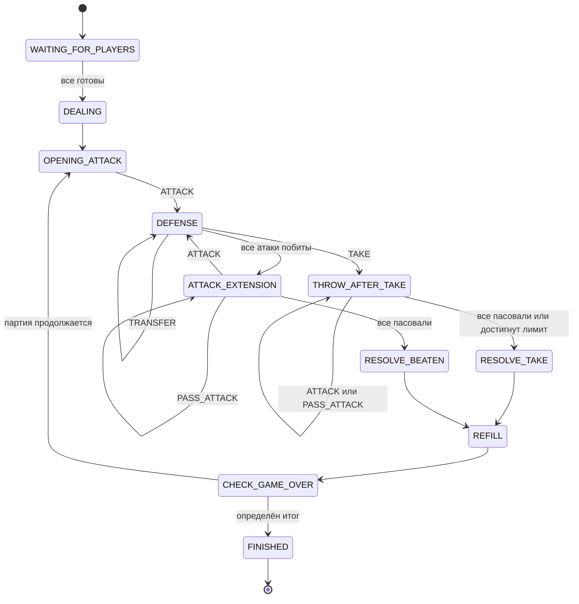

# Конечный автомат партии

Версия: `0.2.0-draft`

## 1. Назначение

Этот документ определяет состояния авторитетного игрового движка.

Одинаковые переходы должны использовать:

- сайт;
- тестовые боты;
- replay;
- будущая нейросеть;
- сервер восстановления партии.

## 2. Фазы

```text
WAITING_FOR_PLAYERS
DEALING
OPENING_ATTACK
DEFENSE
ATTACK_EXTENSION
THROW_AFTER_TAKE
RESOLVE_TAKE
RESOLVE_BEATEN
REFILL
CHECK_GAME_OVER
FINISHED
```

## 3. Фазы, требующие действий игроков

| Фаза | Кто может действовать | Действия |
|---|---|---|
| `OPENING_ATTACK` | Только главный атакующий | `ATTACK` |
| `DEFENSE` | Только защитник | `DEFEND`, `TRANSFER`, `TAKE` |
| `ATTACK_EXTENSION` | Все непасовавшие атакующие | `ATTACK`, `PASS_ATTACK` |
| `THROW_AFTER_TAKE` | Все непасовавшие атакующие | `ATTACK`, `PASS_ATTACK` |

Остальные фазы выполняются автоматически.

## 4. Общая схема



## 5. Контекст раунда

```text
round_starter
main_attacker
defender
attack_order
eligible_attackers
passed_attackers
attack_count
attack_limit
transfer_locked
take_declared
table_slots[6]
```

### `round_starter`

Игрок, начавший текущий раунд. Не изменяется после переводов.

### `main_attacker`

Игрок:

- выполняющий первую атаку;
- находящийся первым в порядке добора;
- используемый при вычислении ролей следующего раунда.

При переводе главным атакующим становится переводящий игрок.

### `defender`

Единственный игрок, который может действовать в фазе `DEFENSE`.

### `attack_order`

Упорядоченный список всех активных игроков, кроме защитника. Главный
атакующий находится первым.

Список используется для:

- порядка добора;
- отображения ролей;
- детерминированной сериализации состояния.

Он не задаёт очерёдность подкидывания.

### `eligible_attackers`

Множество игроков, которые могут подкинуть или пасовать без очереди.

Обычно:

```text
eligible_attackers = active_players - defender
```

### `passed_attackers`

Множество атакующих, пасовавших после последней добавленной атакующей карты.

После любого принятого `ATTACK` множество полностью очищается.

### `take_declared`

Показывает, что защитник уже выбрал «Беру». После этого:

- защита запрещена;
- перевод запрещён;
- отменить взятие нельзя;
- атакующие могут доподкинуть карты.

## 6. `WAITING_FOR_PLAYERS → DEALING`

Условия:

- число занятых мест равно размеру комнаты;
- каждый игрок нажал «Готов»;
- игра ещё не запущена.

Действия:

1. сервер создаёт непредсказуемую перестановку 52 карт;
2. движок проверяет её корректность;
3. игрокам раздаётся по шесть карт;
4. определяется козырь;
5. первым атакующим становится владелец младшего козыря;
6. если в руках нет козырей, используется игрок после сдающего;
7. создаётся версия состояния `1`.

## 7. `OPENING_ATTACK → DEFENSE`

Проверки `ATTACK(card)`:

- действие отправил `main_attacker`;
- карта находится в его руке;
- стол пуст;
- игрок активен.

Изменения:

- карта удаляется из руки;
- создаётся первый слот;
- `attack_count = 1`;
- `phase = DEFENSE`.

## 8. Действия в `DEFENSE`

### 8.1. `DEFEND(card, target_slot)`

Проверки:

- действие отправил защитник;
- слот существует;
- атака в слоте ещё не побита;
- карта находится в руке защитника;
- карта бьёт выбранную атаку.

Изменения:

- карта удаляется из руки;
- записывается в `target_slot.defense`;
- `transfer_locked = true`.

Следующий переход:

- если остались непобитые атаки, фаза остаётся `DEFENSE`;
- если все атаки побиты, фаза становится `ATTACK_EXTENSION`.

### 8.2. `TRANSFER(card)`

Проверки:

- действие отправил защитник;
- `transfer_locked = false`;
- `take_declared = false`;
- карта находится в руке защитника;
- достоинство соответствует достоинству атак;
- после перевода не нарушен лимит;
- существует следующий активный игрок;
- у нового защитника достаточно карт.

Изменения:

1. карта перевода удаляется из руки;
2. создаётся новый непобитый атакующий слот;
3. прежний защитник становится `main_attacker`;
4. следующий активный игрок становится `defender`;
5. `attack_limit` при необходимости уменьшается;
6. перестраиваются `attack_order` и `eligible_attackers`;
7. очищается `passed_attackers`;
8. фаза остаётся `DEFENSE`.

### 8.3. `TAKE`

Проверки:

- действие отправил защитник;
- на столе есть минимум одна атакующая карта;
- взятие ещё не объявлено.

Изменения:

- `take_declared = true`;
- `passed_attackers` очищается;
- если `attack_count == attack_limit`, устанавливается
  `phase = RESOLVE_TAKE`;
- иначе устанавливается `phase = THROW_AFTER_TAKE`.

Карты пока остаются на столе.

## 9. `ATTACK_EXTENSION`

### 9.1. Кто может действовать

Все участники `eligible_attackers` могут отправлять команды без очереди.

Игрок из `passed_attackers` временно не может атаковать. Он снова получает
это право, если другой атакующий добавил карту и сбросил все пассы.

### 9.2. `ATTACK(card)`

Проверки:

- игрок входит в `eligible_attackers`;
- игрок не находится в `passed_attackers`;
- карта находится в его руке;
- достоинство карты присутствует на столе;
- `attack_count < attack_limit`;
- на столе меньше шести атакующих карт.

Изменения:

- карта удаляется из руки;
- создаётся новый слот атаки;
- `attack_count += 1`;
- `passed_attackers` очищается;
- `phase = DEFENSE`.

### 9.3. `PASS_ATTACK`

Игрок добавляется в `passed_attackers`.

Если:

```text
passed_attackers == eligible_attackers
```

то:

```text
phase = RESOLVE_BEATEN
```

## 10. `THROW_AFTER_TAKE`

Защитник уже обязан получить стол и больше не принимает решений.

### 10.1. `ATTACK(card)`

Действие доступно любому непасовавшему игроку из `eligible_attackers`.

Проверки:

- карта находится в руке отправителя;
- достоинство карты уже присутствует на столе;
- `attack_count < attack_limit`;
- на столе меньше шести атакующих карт.

Изменения:

- карта удаляется из руки;
- создаётся непобитый слот атаки;
- `attack_count += 1`;
- `passed_attackers` очищается;
- фаза остаётся `THROW_AFTER_TAKE`.

Если достигнут `attack_limit`, движок автоматически переходит в
`RESOLVE_TAKE`.

### 10.2. `PASS_ATTACK`

Игрок добавляется в `passed_attackers`.

Когда все атакующие пасовали:

```text
phase = RESOLVE_TAKE
```

### 10.3. Запрещённые действия

В этой фазе запрещены:

- `DEFEND`;
- `TRANSFER`;
- повторный `TAKE`;
- отмена взятия.

## 11. Конкурентные действия атакующих

Пусть A и C одновременно отправили `ATTACK` для версии `42`.

Сервер:

1. получает обе команды;
2. одна транзакция первой блокирует партию;
3. действие проверяется и создаёт версию `43`;
4. вторая транзакция видит `expectedVersion = 42`;
5. второе действие отклоняется как `STALE_STATE`;
6. клиент получает snapshot версии `43`;
7. клиент может повторить действие, если оно осталось допустимым.

Первым считается не действие с более ранним клиентским временем, а действие,
которое сервер первым корректно зафиксировал.

## 12. `RESOLVE_TAKE`

Автоматические действия:

1. все карты стола добавляются в руку игрока, объявившего взятие;
2. стол очищается;
3. следующим главным атакующим становится следующий активный игрок после
   взявшего;
4. формируется порядок добора;
5. создаётся событие `TABLE_TAKEN`;
6. `phase = REFILL`.

Карты, взятые со стола, остаются публично известными до того момента, когда
будут сыграны. UI не обязан показывать их постоянный список.

## 13. `RESOLVE_BEATEN`

Автоматические действия:

1. все карты стола переходят в отбой;
2. стол очищается;
3. успешный защитник становится следующим главным атакующим;
4. формируется порядок добора;
5. создаётся событие `ROUND_BEATEN`;
6. `phase = REFILL`.

## 14. `REFILL`

Порядок:

1. текущий главный атакующий;
2. остальные атакующие по часовой стрелке;
3. текущий защитник последним.

Каждый игрок добирает до шести карт.

Для каждого игрока сервер создаёт:

- приватное событие с идентификаторами взятых карт;
- публичное событие только с количеством взятых карт.

После завершения:

```text
phase = CHECK_GAME_OVER
```

## 15. `CHECK_GAME_OVER`

Движок:

1. проверяет, пуста ли колода;
2. находит активных игроков с пустыми руками;
3. фиксирует их `placement`;
4. удаляет вышедших из порядка ходов;
5. проверяет число оставшихся активных игроков.

Если остался последний игрок:

```text
isDurak = true
phase = FINISHED
```

Если несколько игроков вышли одновременно:

- вдвоём фиксируется ничья;
- втроём вышедшие делят место.

Если партия продолжается:

1. выбираются новый главный атакующий и защитник;
2. очищается контекст раунда;
3. вычисляется новый `attack_limit`;
4. `phase = OPENING_ATTACK`.

## 16. Пример перевода втроём

Начальное состояние:

```text
A — главный атакующий
B — защитник
C — дополнительный атакующий
```

Действия:

```text
A: ATTACK(7♣)
B: TRANSFER(7♥)
```

Новое состояние:

```text
B — главный атакующий
C — защитник
A — дополнительный атакующий

Стол:
7♣ / пусто
7♥ / пусто
```

Только C может выполнить:

- `DEFEND`;
- `TRANSFER`;
- `TAKE`.

## 17. Пример подкидывания после «Беру»

Состояние:

```text
A и C — атакующие
B — защитник

Стол:
7♣ / 9♣
9♥ / пусто
```

Действия:

```text
B: TAKE
C: ATTACK(7♠)
A: PASS_ATTACK
C: PASS_ATTACK
```

Результат:

- после `TAKE` включается `THROW_AFTER_TAKE`;
- `7♠` добавляется как непобитая атака;
- после паса обоих атакующих весь стол получает B.

## 18. Защита от зависания

Для любой игровой фазы множество легальных действий не должно быть пустым:

- в `OPENING_ATTACK` у главного атакующего есть карта;
- в `DEFENSE` всегда разрешён `TAKE`;
- в `ATTACK_EXTENSION` непасовавшему атакующему разрешён `PASS_ATTACK`;
- в `THROW_AFTER_TAKE` непасовавшему атакующему разрешён `PASS_ATTACK`.

Если условие нарушено, это ошибка движка, а не игровая ничья.

Обычного таймера хода в первой версии нет. При отключении игрока партия
ставится на паузу на 120 секунд.
