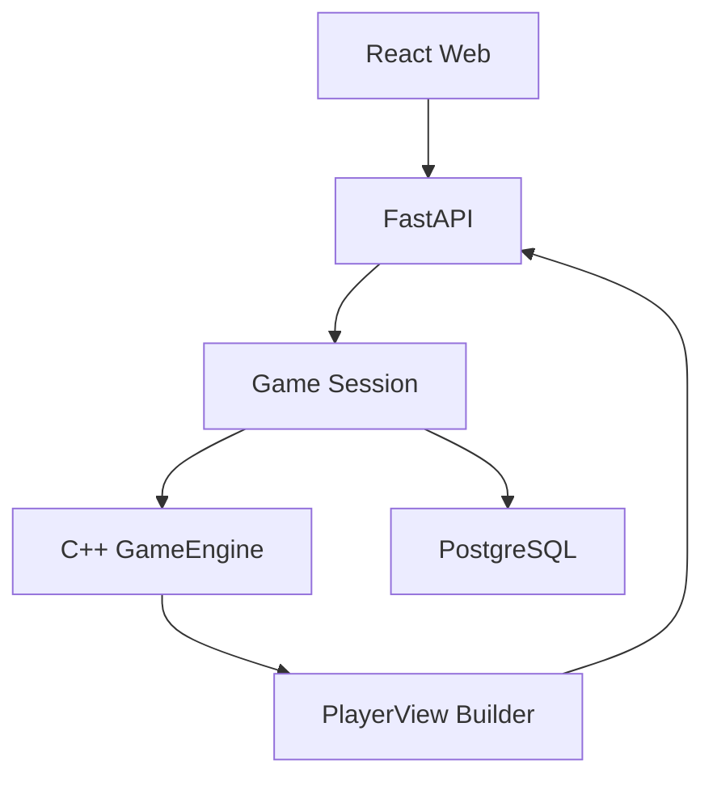

# Архитектурные границы

Версия: `0.2.1-draft`

## 1. Главный принцип

В проекте существует одна реализация правил:

```text
C++ GameEngine
```

Frontend, backend-контроллер и будущая нейросеть не дублируют игровую логику.

## 2. Компоненты



## 3. C++ GameEngine

Отвечает за:

- колоду и карты;
- руки;
- козырь;
- роли;
- порядок игроков;
- фазы раунда;
- легальные действия;
- атаку;
- защиту;
- перевод;
- взятие;
- добор;
- выход игроков;
- результат;
- сериализацию чистого игрового состояния.

Не отвечает за:

- пользователей;
- WebSocket;
- комнаты;
- базу данных;
- таймер соединения;
- анимации;
- HTTP;
- токены авторизации.

Основной контракт:

```text
GameState + PlayerAction
        ↓
Validation
        ↓
New GameState + DomainEvents
```

## 4. Game Session

Отвечает за:

- связь пользователя с местом игрока;
- блокировку конкурентных команд;
- проверку `expectedVersion`;
- идемпотентность `clientActionId`;
- определение порядка конкурентных команд через серверную транзакцию;
- загрузку и сохранение snapshot;
- вызов GameEngine;
- персональную рассылку состояний;
- паузу и переподключение.

Не определяет:

- бьёт ли карта другую;
- можно ли переводить;
- кто атакует следующим;
- закончилась ли партия.

## 5. React-клиент

Отвечает за:

- отображение состояния;
- выбор действия;
- отправку команды;
- анимации подтверждённых событий;
- восстановление WebSocket;
- отображение ошибок.

Не имеет права:

- удалять карты из руки до подтверждения сервера;
- вычислять итог раунда как источник истины;
- видеть полное состояние;
- отправлять новую руку или новый стол;
- назначать роли.

Frontend MAY локально вычислять только визуальные производные данные:

- группировку карт;
- сортировку собственной руки;
- индикаторы мастей;
- доступность кнопок из уже полученного списка `legalActions`.

В фазах конкурентного подкидывания frontend MAY отправить действие сразу,
если оно присутствует в `legalActions`. Он MUST быть готов получить
`STALE_STATE`, заменить snapshot и предложить повторить ход.

## 6. PostgreSQL

Хранит:

- комнаты;
- участников;
- партии;
- версию правил;
- полные серверные snapshots;
- последовательность действий;
- результаты.

База не исполняет игровые правила.

## 7. Источник истины

При конфликте:

```text
GameEngine state
    важнее
cached frontend state
```

После переподключения клиент всегда заменяет локальное состояние полным
snapshot сервера.

Порядок «кто быстрее подкинул» определяется только первым успешно
зафиксированным серверным действием. Клиентское время не является источником
истины.

## 8. Скрытая информация

Полный `GameState` доступен только серверу.

Для каждого участника строится отдельный `PlayerView`.

Обязательные ограничения:

- собственная рука видна полностью;
- чужая рука представлена только количеством карт;
- порядок колоды не передаётся;
- приватные карты добора получает только соответствующий игрок;
- зритель в будущем получает отдельный `SpectatorView`.

## 9. Генерация колоды

Для человеческой сетевой игры порядок карт создаётся криптографически
стойким генератором на сервере и не раскрывается до завершения партии.

Движок принимает готовую проверенную перестановку 52 карт.

Для тестов и будущего self-play движок MAY предоставлять детерминированный
метод:

```text
reset(seed)
```

## 10. Сохранение действия

Одна серверная транзакция:

```text
заблокировать game
        ↓
проверить version и clientActionId
        ↓
десериализовать GameState
        ↓
применить действие
        ↓
сохранить action
        ↓
сохранить новый snapshot
        ↓
увеличить version
        ↓
commit
        ↓
broadcast
```

Рассылка выполняется только после успешного commit.

## 11. Рекомендуемая структура

```text
chinese-durak/
├── engine/
│   ├── include/durak/
│   ├── src/
│   └── tests/
├── bindings/
├── apps/
│   ├── api/
│   └── web/
├── protocol/
├── docs/
├── docker-compose.yml
└── CMakeLists.txt
```

## 12. Граница первой версии

Входит:

- приватные комнаты;
- два или три человека;
- никнеймы;
- приглашение по ссылке;
- перевод;
- подкидывание;
- конкурентное подкидывание всеми незащищающимися игроками;
- подкидывание после «Беру»;
- восстановление соединения;
- replay;
- адаптивный игровой стол.

Не входит:

- нейросеть;
- публичный matchmaking;
- рейтинг;
- чат;
- зрители;
- магазин;
- турниры;
- несколько наборов правил.
- таймер обычного хода.

## 13. Подготовка к будущей нейросети

Уже в человеческой версии необходимо сохранять:

- версию правил;
- число игроков;
- исходный порядок карт или закрытый seed;
- последовательность действий;
- действующего игрока;
- PlayerView перед действием;
- список легальных действий;
- итог партии.

Нейросеть в будущем должна получать `PlayerView`, а не полный `GameState`.

Self-play будет вызывать GameEngine напрямую через pybind11, без HTTP,
WebSocket и PostgreSQL.
